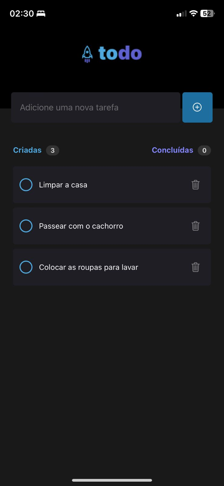
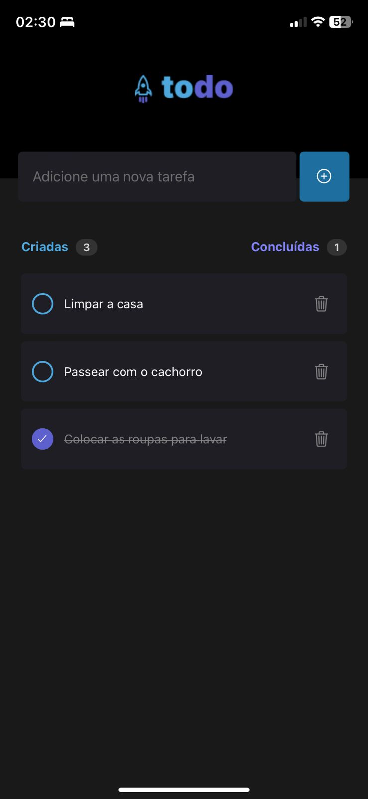
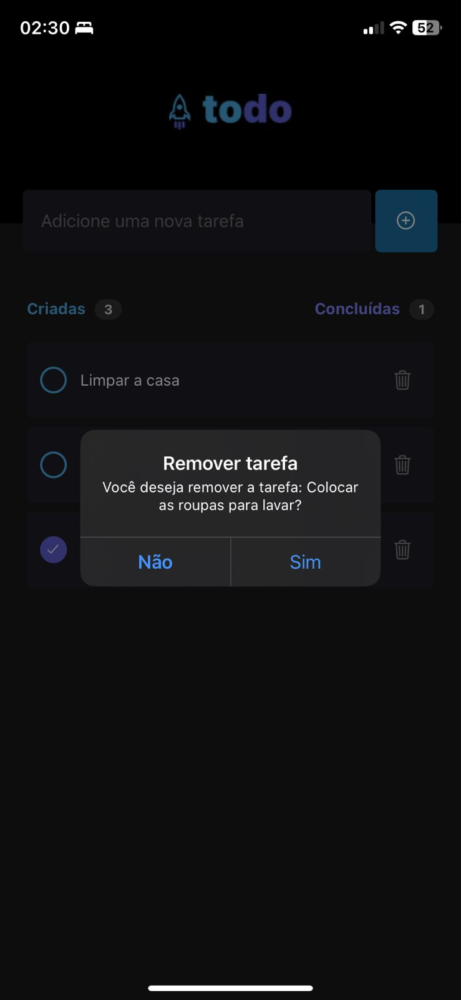

# 📲 Mobile To do List

This project is a simple mobile application developed with React Native and TypeScript, allowing users to create a To do list.

## Features

- Add a Task.
- Remove a Task.
- Mark task as complete.
- Shows an alert when you already have a registered task.

## Technologies Used

- React Native
- TypeScript
- Expo

## Screenshots

